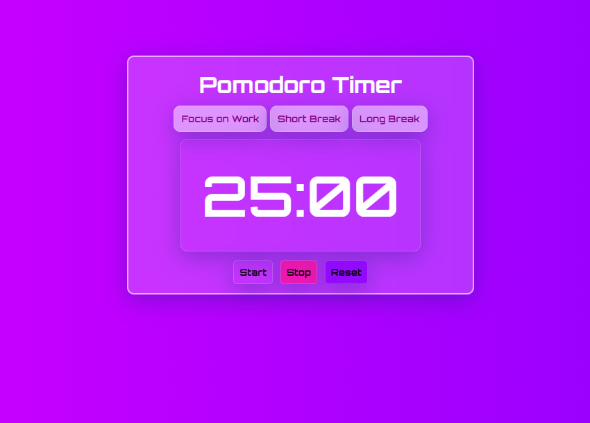

# GRS - Pomodoro Timer

A simple Pomodoro Timer web application to help you manage your time effectively using the Pomodoro Technique. This application allows you to focus on work for a set period, take short breaks, and longer breaks at regular intervals.

<div align="center">
  
</div>

## Features

- **Focus Timer**: Set a timer for focused work sessions (default 25 minutes).
- **Short Break Timer**: Set a timer for short breaks (default 5 minutes).
- **Long Break Timer**: Set a timer for long breaks (default 15 minutes).
- **Start, Stop, and Reset**: Control the timer with start, stop, and reset buttons.
- **Responsive Design**: Works on various screen sizes.
- **Custom Fonts**: Uses Google Fonts for a clean and modern look.

## Technologies Used

- HTML
- CSS
- JavaScript

## Setup

### Clone the Repository

```bash
git clone https://github.com/GR-SALMAN/Purple-Pomodoro-Timer
cd pomodoro-timer
```
### Open the Project

Open the `index.html` file in your web browser:

```bash
open index.html
```
### Usage
1. **Choose a Timer:** Click on one of the buttons (Focus on Work, Short Break, or Long Break) to set the timer for the respective activity.
2. **Start the Timer:** Click the "Start" button to begin the countdown.
3. **Stop the Timer:** Click the "Stop" button to pause the countdown.
4. **Reset the Timer:** Click the "Reset" button to reset the timer to the initial value of the selected activity.

>If you find any issues with the project, feel free to submit and issue (Better with the solution)
